# **Guess Master**

Guess master is a game where the player tries to guess the number that the computer is thinking of in 3 tries.
The computer tells them the range and if they guess a number higher than the number that computer is thinking of, the computer tells them to go lower and if they guess a lower number, the computer tells them to go higher.
If they guess the number before the tries finish, they win otherwise they lose.

## **Planning stage** 
### **Target Audience**
* Anyone who likes to play guess-the-number games.
* Anyone who likes challenges.

### **Site Aims**
1. Make a fun guess-the-number game
2. Make the game with clear instructions on how to play and where user input is required.
3. Handle errors caused by player inputs and avoid crushing due to wrong inputs by the players. 

### **User stories** 
* Play a fun guess-the-number game
* If the guess of the number is wrong, a hint should be given to the player to improve the guess.
* The player should know the range of the numbers that the guess should be within.
* If the player fails, the number should be displayed. 
* Limit the number of tries the player gets to guess the number to make the game more fun. 

### **The plan to achieve the goals** 
* Build the game with clear instructions guiding the players on how to input and display clear feedback following correct or incorrect user input. 
* Make the game fun by adding a number of tries which the player gets to guess the number that resets each time they start the game. 
* Make the game fun by also adding a hint following each wrong guess.
* Display the range of the number to be guessed and display the number if the player is right or if the tries run out. 

## **Game Flow chart**
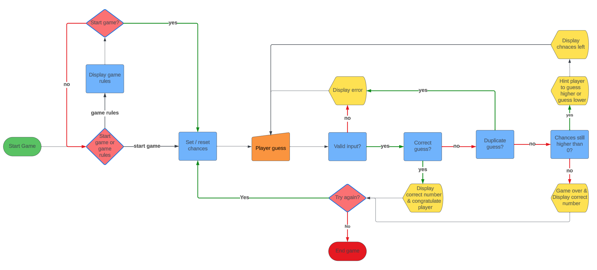

## **Game Features**

### **Welcome page**

### **Game-rules page**
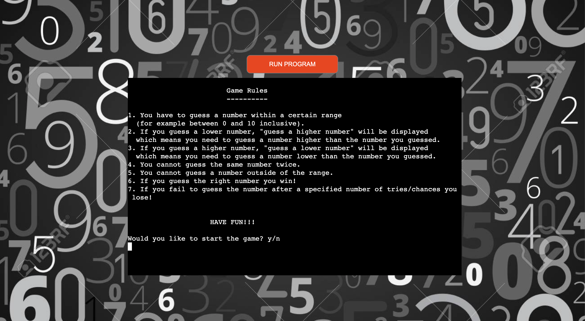

### **Welcome page error handling**
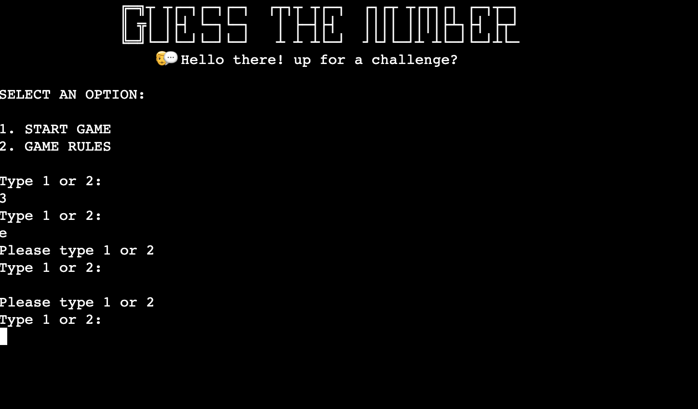

### **Game-rules page error handling**
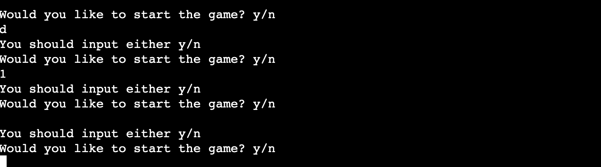

### **Gameplay page**
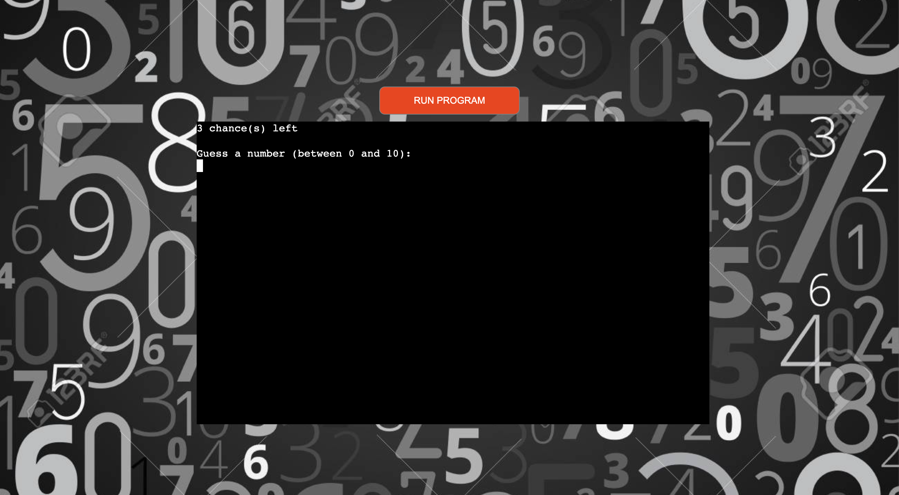

### **Gameplay page error handling**
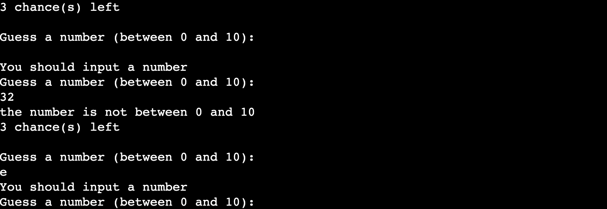

### **Higher hint display**
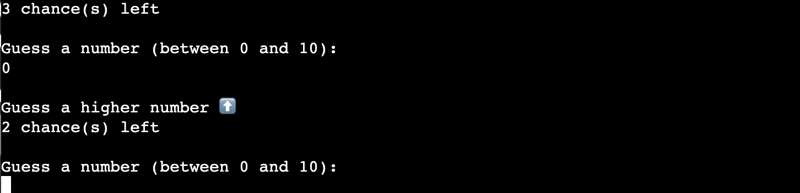

### **Lower hint display**
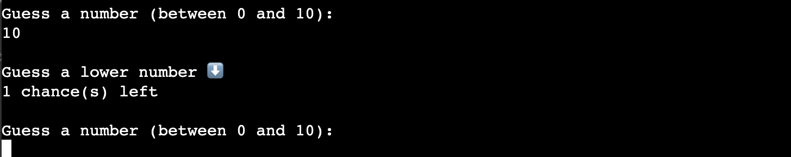

### **Win display**
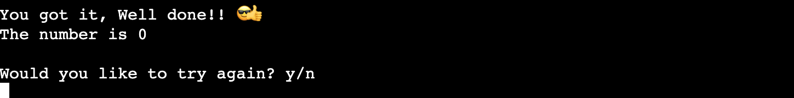

### **Lose display**
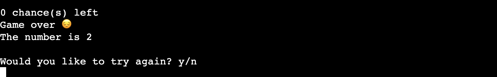

### **Duplicate number error handling**
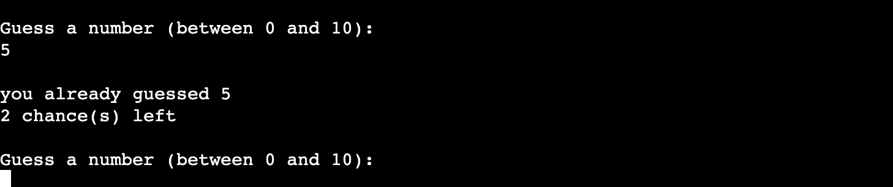

## **Deployment**
I took these steps to deploy the game to [Heroku.com](https://www.heroku.com)

1. Log in to your Heroku account or Create a new account.
2. On the dashboard click new and then create new app.
3. choose and enter a unique name, select the region and click create app.
4. Select the Settings tab in the created app.
5. Scroll down to add buildpack and click on it. 
6. Choose python and press add buildpack. 
7. Repeat step 5 and choose node.js.
8. Navigate to the Deploy tab on top.
10. Select GitHub as the deployment method and connect to GitHub.
11. Search for the repository name of the project and click connect.
12. I enabled automatic deploys in order to deploy each time new code is pushed to the repository.
13. Click Deploy Branch to deploy the project.
 

 
