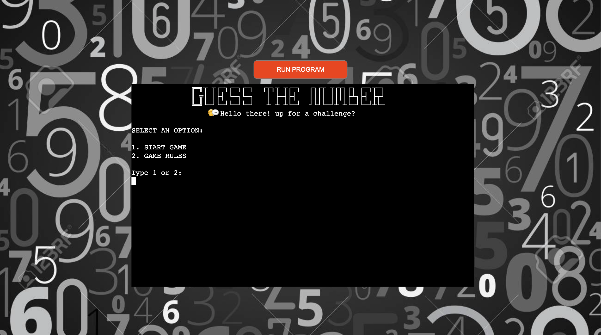

# **Guess Master**

Guess master is a game where the player tries to guess the number that the computer is thinking of in 3 tries.
The computer tells them the range and if they guess a number higher than the number that computer is thinking of, the computer tells them to go lower and if they guess a lower number, the computer tells them to go higher.
If they guess the number before the tries finish, they win otherwise they lose.

## **Planning stage** 
### **Target Audience**
* Anyone who likes to play guess-the-number games.
* Anyone who likes challenges.

### **Site Aims**
1. Make a fun guess-the-number game
2. Make the game with clear instructions on how to play and where user input is required.
3. Handle errors caused by player inputs and avoid crushing due to wrong inputs by the players. 

### **User stories** 
* Play a fun guess-the-number game
* If the guess of the number is wrong, a hint should be given to the player to improve the guess.
* The player should know the range of the numbers that the guess should be within.
* If the player fails, the number should be displayed. 
* Limit the number of tries the player gets to guess the number to make the game more fun. 

### **The plan to achieve the goals** 
* Build the game with clear instructions guiding the players on how to input and display clear feedback following correct or incorrect user input. 
* Make the game fun by adding a number of tries which the player gets to guess the number that resets each time they start the game. 
* Make the game fun by also adding a hint following each wrong guess.
* Display the range of the number to be guessed and display the number if the player is right or if the tries run out. 

## **Game Flow chart**

## **Game Features**

### **Welcome page**
The welcome page contains the game title in ASCII art to make it unique and stand out.
I used emojis throughout the game to make it more appealing to the players.
On the welcome page, The players can either start the game or access the game rules to familiarise themselves with how the game works.

### **Game-rules page**
The game-rules page explains to the players how the game is played, how to win and how one can lose.
The players can also start the game from this page after reading the rules and understanding how to play the game.

### **Welcome page error handling**
On the welcome page where a player input of 1 or 2 is required, 
the player is asked again to "type 1 or 2" if they type in a number 
that is not 1 or 2. If they type nothing or not type a number 
an error is raised and "please type 1 or 2" is displayed.
 

### **Game-rules page error handling**
On the game-rules page an error is raised and "You should input either y/n"
is displayed if the player does not input anything or gives a wrong input. 

### **Gameplay page**
At the start of the gameplay, the number of chances the player has to guess the number
and the input requiring the player to guess a number are displayed. 
 

### **Gameplay page error handling**
During the game play if you send an empty input or not input a number, 
an error is raised and the message "You should input a number" is displayed.
If you input a number not in the required range, a message claiming that
the number is not in the required range is displayed and the player is asked
to guess the number again without losing any of their chances. 
  

### **Higher hint display**
Guessing a number lower than the number to be guessed displays a hint to the player that
they need to "guess a higher number".

### **Lower hint display**
Guessing a number higher than the number to be guessed displays a hint to the player that
they need to "guess a lower number".

### **Win display**
When the player wins, a message congratulating the player and a cool face emoji doing a thumbs up is displayed
to give the feedback that the player has successfully guessed the number right. The correct number is also displayed.

### **Lose display**
When the player loses, the message "Game over" and a pensive face emoji is displayed to give 
the feedback that the player has failed to guess the number after using all available tries. 
The correct number is also displayed. 

### **Duplicate number error handling**
Guessing the same number twice is not accepted however, the player does not lose tries for it
instead a message that they already guessed that number is displayed and the player can try again. 

## **Deployment**
I took these steps to deploy the game to [Heroku.com](https://www.heroku.com)

1. Log in to your Heroku account or Create a new account.
2. On the dashboard click new and then create new app.
3. choose and enter a unique name, select the region and click create app.
4. Select the Settings tab in the created app.
5. Scroll down to add buildpack and click on it. 
6. Choose python and press add buildpack. 
7. Repeat step 5 and choose node.js.
8. Navigate to the Deploy tab on top.
10. Select GitHub as the deployment method and connect to GitHub.
11. Search for the repository name of the project and click connect.
12. I enabled automatic deploys in order to deploy each time new code is pushed to the repository.
13. Click Deploy Branch to deploy the project.
 

 
